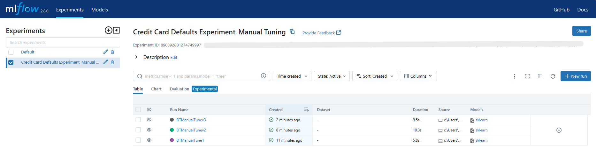

# Predicting Default Credit Card Clients

## Project Description
> Demonstrate how MLFlow works by using the Credit Card Default Dataset
> 
## Project Coverage

PART 1
>  Setup MLFlow Experiment for Manual Tuning <br>
>  Create Runs for Manual Tuning Experiment (captures different parameters based on user input) <br>
>  Save experiments and runs on local server <br>
 <br>
>  Save experiments and runs on a remote server (DagsHub) <br>

PART 2
>  Setup MLFlow Experiment for HyperParameter Tuning <br>
>  Create Runs for Hyperparameter Tuning Experiment <br>
>>>>>>  Run 1: DecisionTreeClassifier - Best Model <br>
>>>>>>  Run 2: DecisionTreeClassifier - Different Predictors <br>
>>>>>>  Run 3: DecisionTreeClassifier - Different Numerical Transformations <br>
>>>>>>  Run ∞: Repeat Runs using other classifier models <br>


## Model
> Decision Tree

## Data Source
> https://archive.ics.uci.edu/static/public/350/default+of+credit+card+clients.zip

## Installation
Install all requirements by running the following command

> pip install requirements.txt

## Project Configurations

> Hyperparameter Tuning: `Manual` <br>
> Pipeline: `NA` <br>
> Model Tracking: `MLFlow` <br>
> Deployment: `NA`

## Project Folder Structure
```text
├── ...
├── 01_src  				# Source code
│   ├── download_data.py
├── 02_data
│   ├── 01_raw  			# Raw data files
│   ├── 02_processed 			# Processed data files
│   └── 03_external  			# Data from external sources
├── 03_notebooks  			# Notebooks used for pre-processing, exploration, model training, etc 
├── 03_src  				# Source code
├── 04_models  				# Trained model files, model metadata, and evaluation results
├── 05_deployment  			# Project deployment files
├── 06_reports  			# Project documentation, Jupyter Notebook reports, final reports, and presentations
├── 07_config  				# Configuration files for hyperparameters, data sources, logging, environment, database, and deployment
├── 08_tests 				# Unit tests or test scripts
├── 09_environments 		        # Environment setup file (dependencies)
├── README.md
└── ...
```
## Pull Requests

If you have something to add or a new idea to implement, you are welcome to create a pull request on improvement.

## References
- [Introduction to MLFlow](https://youtu.be/ksYIVDue8ak?si=WkzthJ9yQWPYZ8Nw)
- [Setting Up MLLFlow Experiments to a Remote Server](https://youtu.be/K9se7KQON5k?si=rcnz5SCuzGG4KhX1)
- [Kaggle Notebook](https://www.kaggle.com/code/satyamsss/credit-card-default-prediction-82-accurate)


## Give it a Star

If you find this repo useful, give it a star so as many people can get to know it.


